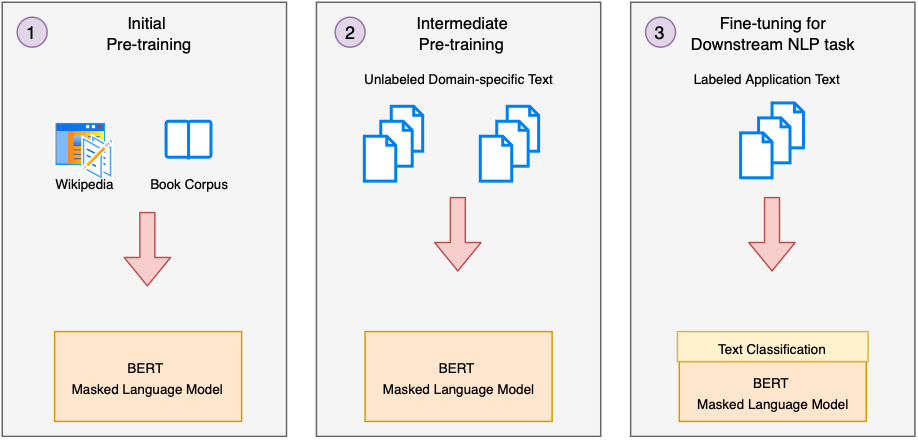

## Large Language Model (LLM) from Scratch on Amazon SageMaker
This repository contains the supporting notebooks for a medium article on training an LLM from scratch with a custom domain corpus and Amazon SageMaker.

The series covers the following topics:

### Module 1: Acquiring the dataset
Learn how to acquire and preprocess your custom domain corpus for training the LLM.

### Module 2: Customizing vocabulary
Understand how to customize the vocabulary of the LLM to fit your dataset.

### Module 3: Tokenizing datasets
Learn how to tokenize your dataset and prepare it for training.

### Module 4: Intermediate training
Discover how to perform intermediate training on the LLM using Amazon SageMaker.

### Module 5: Deployment as an endpoint
Explore how to deploy the trained LLM as an endpoint for inference.

#### Prerequisites
To follow along with the notebooks in this repository, you will need an AWS account with access to Amazon SageMaker. Additionally, you will need to have a custom domain corpus ready for training.

#### Getting started
To get started, clone this repository and open the notebooks in the order they are presented in the series. Each notebook contains detailed instructions and explanations for the corresponding module.
